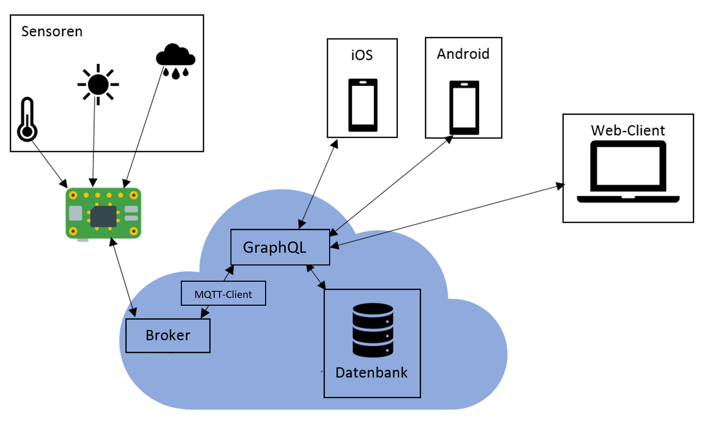
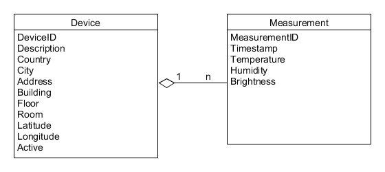

# Anforderungs- und Entwurfsspezifikation: Wetterstation

* Autoren

  * Jonas Raddatz
  * André Matutat
  * Daniel Räder
  * Dejan Novakovic
  * Simon Safar

* Software Repo

  * [Backend Repo](<https://github.com/jraddatz/IoT-App-Backend>)
  * [WebFrontend Repo](<https://github.com/FranNk3/IoT-App-WebFrontend>)
  * [MobileFrontend Repo](https://github.com/ChamounInfo/IoT-App-MobileFrontend)


**Inhaltsverzeichnis** 

- [Einführung](#1 Einführung)
  - [Beschreibung](#1.1 Beschreibung)
  - [Ziele](#1.2 Ziele)
- [Anforderungen](#2 Anforderungen)
  - [Stakeholder](#2.1 Stakeholder)
  - [Anforderungen](#2 Anforderungen)
  - [Funktionale Anforderungen](#2.2 Funktionale Anforderungen)
  - [Nicht-funktionale Anforderungen](#2.3 Nicht-funktionale Anforderungen)]
  - [GUI](#2.4 Graphische Benutzerschnittstelle)
- [Technische Beschreibung](#3 Technische Beschreibung)
  - [Systemübersicht](#3.1 Systemübersicht)
  - [Softwarearchitektur](#3.2 Softwarearchitektur)
  - [Datenmodell](#3.3 Datenmodell)
  - [Abläufe](#3.4 Abläufe)
- [Projektorganisation](#4 Projektorganisation)
  - [Annahmen](#4.1 Annahmen)
  - [Verantwortlichkeiten](#4.2 Verantwortlichkeiten)
  - [Grober Projektplan](#4.3 Grober Projektplan)
- [Anhänge](#5 Anhänge)

# 1 Einführung

## 1.1 Beschreibung

**Wetterstation**

Im Zuge dieses Projekts sollen an mehreren Standorten Wetterdaten wie Temperatur, Luftfeuchtigkeit o.ä. gemessen werden. Die erfassten Daten werden daraufhin gespeichert, ausgewertet, plattformunabhängig visualisiert und online dargestellt. Die Standorte werden hierarchisch in Gebäude, Stockwerke und Räume unterteilt oder gruppiert. Es sollen des weiteren Grenzwerte konfigurierbar sein und bei Überschreitung dieser der Benutzer benachrichtigt werden.

## 1.2 Ziele

- keine Steuerung, nur Visualisierung und Information
- Integration unterschiedlichster Sensorik ermöglichen
- einfache und übersichtliche grafische Darstellung

# 2 Anforderungen

## 2.1 Stakeholder

| Funktion      | Name                | Kontakt                    | Verfügbarkeit | Wissen                                   | Interesse & Ziele                        | Relevanz  |
| ------------- | ------------------- | -------------------------- | ------------- | ---------------------------------------- | ---------------------------------------- | --------- |
| Administrator | Herr Router         | 127.0.0.1                  | 60%           | Kennt die Infrastruktur. Soll das System in stand halten | Einfache Administration des System.      | Hoch      |
| Benutzer      | Frau Dr. Raum-Klima | 0800 Nase                  | 70%           | Fachkenntnisse. Wertet Ergebnisse aus. Soll das System Bedienen. | Einfache Bedienbarkeit, Übersichtlich, Zuverlässigkeit, Integrität | Sehr Hoch |
| Benutzer      | Thomas Müller       | tmueller14@fh-bielefeld.cz | 20%           | Wenig.                                   | Daten sollen auch für ihn als Laien übersichtlich dargestellt werden. | Mittel    |

## 2.2 Funktionale Anforderungen

### Use-Case Diagramm


## 2.3 Nicht-funktionale Anforderungen 

### 2.3.1 Rahmenbedingungen

- Die Messungen sollen mithilfe eines Raspberry Pi getätigt werden.
- Die Daten sollen in einer Datenbank gespeichert werden

### 2.3.2 Betriebsbedingungen

- Webclient:
  - Mozilla Firefox mind. 66.0.0
- Mobile:
  - Android mind. 6.0 oder iOS mind. 9

### 2.3.3 Qualitätsmerkmale
| Qualitätsmerkmal           | sehr gut | gut  | normal | nicht relevant |
| -------------------------- | -------- | ---- | ------ | -------------- |
| **Zuverlässigkeit**        |          |      |        |                |
| Fehlertoleranz             | -        | X    | -      | -              |
| Wiederherstellbarkeit      | -        | X    | -      | -              |
| Ordnungsmäßigkeit          | X        | -    | -      | -              |
| Richtigkeit                | X        | -    | -      | -              |
| Konformität                | X        | -    | -      | -              |
| **Benutzerfreundlichkeit** |          |      |        |                |
| Installierbarkeit          | -        | -    | x      | -              |
| Verständlichkeit           | X        | -    | -      | -              |
| Erlernbarkeit              | X        | -    | -      | -              |
| Bedienbarkeit              | X        | -    | -      | -              |
| **Performance**            |          |      |        |                |
| Zeitverhalten              | -        | -    | X      | -              |
| Effizienz                  | -        | -    | X      | -              |
| **Sicherheit**             |          |      |        |                |
| Analysierbarkeit           | X        | -    | -      | -              |
| Modifizierbarkeit          | -        | X    | -      | -              |
| Stabilität                 | -        | -    | X      | -              |
| Prüfbarkeit                | -        | -    | X      | -              |

## 2.4 Graphische Benutzerschnittstelle

### Web Frontend


### Mobile Frontend


## 2.5 Anforderungen im Detail

### Userstories


| **Als**       | **möchte ich**                           | **so dass**                              | **Akzeptanz**                            |      |
| :------------ | :--------------------------------------- | :--------------------------------------- | :--------------------------------------- | ---- |
| Benutzer      | Messdaten angezeigt bekommen             | ich die Informationen einsehen kann      | Messdaten werden Dargestellt             | Muss |
| Benutzer      | eine Ortsauswahl in beliebiger Genauigkeit treffen | ich die Messdaten für spezielle Orte einsehen kann | Gebäude, Stockwerk und Raumauswahl sind möglich | Muss |
| Benutzer      | Messdaten für spezielle Zeiten auswählen | ich Informationen über diese Zeiten erhalte | Zeitauswahl ist möglich                  | Soll |
| Administrator | Geräte dem System hinzufügen             | dieses Gerät auch Messungen durchführt   | Hinzufügen von Geräten per Weboberfläche möglich | Muss |
| Administrator | den Status der Geräte Einblicken können  | ich defekte Geräte erkenne               | Statusanzeige der Geräte auf der Weboberfläche implementiert | Kann |
| Benutzer      | Grenzwerte festlegen                     | mich das System benachrichtigt, wenn diese überschritten werden | Grenzwerte können festgelegt werden, System  benachrichtigt User per Push Nachricht | Muss |


# 3 Technische Beschreibung

## 3.1 Systemübersicht

### Systemarchitektur



## 3.2 Softwarearchitektur


## 3.3 Schnittstellen

### MQTT

#### MQTT-Topic

```
country/city/address/building*/floor*/room/id
```

Mit * gekennzeichnete Werte sind nicht verpflichtend.

#### MQTT-Payload

```json
{  
    "measurement" : {
        "timestamp":"2019-05-20T15:05:53+00:00",
        "temperature":"21.7",
        "humidity":"53.1",
        "brightness":"500.0"
  	}
}
```

- timestamp: Datum und Uhrzeit (ISO 8601-konform)
- temperature: Gleitkommazahl, in °C
- humidity: Gleitkommazahl, in %
- brightness: Gleitkommazahl, in Lux

## 3.4 Datenmodell 




## 3.5 Abläufe

### Messdaten einsehen


### Neue Messung


# 4 Projektorganisation

## 4.1 Annahmen

Technologien:

- Frontend:
  - Rust, unter Verwendung des Yew Frameworks
  - React Native für mobile Applikation
  - WebGL 1.0 unter (evtl.) Verwendung der Frameworks StardustJS und D3.js
- Backend:
  - Node.js, Express
  - MongoDB + Compass
- Kommunikation:
  - MQTT Protokoll für Embedded Systeme
  - GraphQL und Websockets für Frontend-Kommunikation
- Hardware
  - Raspberry Pi mit Temperatur-, Licht- und Luftfeuchtigkeits-Sensoren
  - Backend Server in der Azure-Cloud von Microsoft

Git Repositories:

- [Backend Repository & Dokumentation](https://github.com/jraddatz/IoT-App-Backend)
- [Mobile Frontend Repository](https://github.com/ChamounInfo/IoT-App-MobileFrontend)
- [Web Frontend Respository](https://github.com/FranNk3/IoT-App-WebFrontend)


## 4.2 Verantwortlichkeiten
| Softwarebaustein      | Person(en)      |
| --------------------- | --------------- |
| Datenbank             | André Matutat   |
| GraphQL Schnittstelle | André Matutat   |
| MQTT                  | Jonas Raddatz   |
| Raspberry Pi          | Jonas Raddatz   |
| Backend               | Jonas Raddatz   |
| Browser Frontend      | Dejan Novakovic |
| WebGL                 | Daniel Räder    |
| Mobile Frontend       | Simon Safar     |


### Rollenzuordnung

| Name            | Rolle                                 |
| --------------- | ------------------------------------- |
| André Matutat   | Backend-Entwickler, Softwarearchitekt |
| Jonas Raddatz   | Backend-Entwickler, Softwarearchitekt |
| Dejan Novakovic | Frontend-Entwickler                   |
| Daniel Räder    | Frontend-Entwickler                   |
| Simon Safar     | Frontend-Entwickler                   |


## 4.3 Grober Projektplan

### Meilensteine

- 30.04
  - Mockups
  - User Stories
  - Use-Cases
  - Architektur Diagramme
  - Grobe Projektplanung
- 14.05 
  - Datenbank aufgesetzt
  - Backend implementiert
  - Frontend implementiert
- 21.05 
  - Prototyp getestet und verbessert

* 28.05
  * Prototyp Präsentieren
* 18.06
  * CD eingerichtet
  * Hardware eingerichtet
  * Backend fertiggestellt
  * Frontend fertiggestellt
* 25.06
  * Akzeptanztests bestanden
* 02.07
  * Projektpräsentation

# 5 Anhänge

## 5.1 Glossar 

### MQQT
Message Queuing Telemetry Transport (kurz MQTT) ist ein einfach aufgebautes Publish-Subscribe-Protokoll zum Nachrichtenaustausch im Netzwerk. Es benötigt sehr wenig Bandbreite und Funktion auf den Clients, bietet aber trotzdem eine hohe Zuverlässigkeit bei der Nachrichtenübermittlung. Nachrichten werden in sog. Topics, die man sich wie eine Ordnerstruktur vorstellen kann, einsortiert.

### I2C
I²C, für englisch Inter-Integrated Circuit, im Deutschen gesprochen als I-Quadrat-C oder englisch I-Squared-C , ist ein 1982 von Philips Semiconductors (heute NXP Semiconductors) entwickelter serieller Datenbus.Er wird hauptsächlich geräteintern für die Kommunikation zwischen verschiedenen Schaltungsteilen benutzt, z. B. zwischen einem Controller und Peripherie-ICs.

### RS-485
EIA-485, auch als RS-485 bezeichnet, ist ein Industriestandard für eine physische Schnittstelle für die asynchrone serielle Datenübertragung.

### SPI
Das Serial Peripheral Interface (kurz SPI) ist ein im Jahr 1987 von Susan C. Hill Et al., damals bei dem Halbleiterhersteller Motorola (heute NXP Semiconductors), entwickeltes Bus-System und stellt einen „lockeren“ Standard für einen synchronen seriellen Datenbus (Synchronous Serial Port) dar, mit dem digitale Schaltungen nach dem Master-Slave-Prinzip miteinander verbunden werden können.

### GraphQL
GraphQL ist eine, von Facebook entwickelte, opensource Abfragesprache, dessen Fokus auf einfache und flexible Benutzung liegt.

### WebGL
WebGL ist eine 3D Grafik API basierend auf OpenGL (genauer, OpenGL ES, für Embedded Systems). Die API ist für Verwendung in Javascript/ECMAScript in HTML5 gedacht und somit für alle Platformen die HTML5 unterstützen verfügbar.Mit WebGL gerenderte Elemente werden im HTML Canvas Element dargestellt, mit Hilfe eines eigens definierten RenderingContext, WebGLRenderingContext, welcher den standardmäßigen CanvasRenderingContext2D ersetzt.

## 5.2 Referenzen

## 5.3 Index