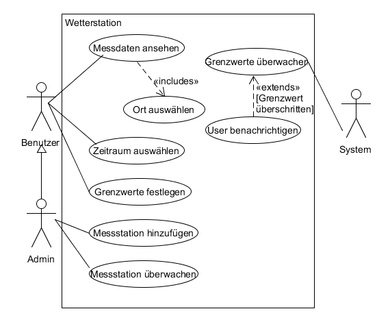

# Anforderungs- und Entwurfsspezifikation ("Pflichtenheft")

* Wetterstation

* !!Inhaltsverzeichnis!!

* Autoren

  * Jonas Raddatz
  * André Matutat
  * Daniel Räder
  * Dejan Novakovic
  * Simon Afaik

* Software Repo

  * [Backend Repo](<https://github.com/jraddatz/IoT-App-Backend>)

  

# 1 Einführung

## 1.1 Beschreibung

**Wetterstation**

Im Zuge dieses Projekts sollen an mehreren Standorten Wetterdaten wie Temperatur, Luftfeuchtigkeit o.ä. gemessen werden. Die erfassten Daten werden daraufhin gespeichert, ausgewertet, plattformunabhängig visualisiert und online dargestellt. Die Standorte werden hierarchisch in Gebäude, Stockwerke und Räume unterteilt oder gruppiert. Es sollen des Weiteren Grenzwerte konfigurierbar sein und bei Überschreitung dieser der Benutzer benachrichtigt werden.

## 1.2 Ziele

- keine Steuerung, nur Visualisierung und Information
- Integration unterschiedlichster Sensorik ermöglichen
- einfache und übersichtliche grafische Darstellung

# 2 Anforderungen

## 2.1 Stakeholder

| Funktion | Name | Kontakt | Verfügbarkeit | Wissen | Interesse & Ziele | Relevanz |
| -------- | ---- | ------- | ------------- | ------ | ----------------- | -------- |
| Administrator | Herr. Router | 127.0.0.1 | 60% | Kennt die Infrastruktur. Soll das System in stand halten | Einfache Administration des System. | Hoch |
| Benutzer | Frau Dr. Blume | 0800 Nase | 70% | Fachkenntnisse. Wertet Ergebnisse aus. Soll das System Bedienen. | Einfache Bedienbarkeit, Übersichtlich, Zuverlässigkeit, Intigrität | Sehr Hoch |

## 2.2 Funktionale Anforderungen

### Use-Case Diagramm

## 2.3 Nicht-funktionale Anforderungen 

### 2.3.1 Rahmenbedingungen

- Die Messungen sollen mithilfe eines Raspberry Pi getätigt werden.
- Die Daten sollen in einer Datenbank gespeichert werden

### 2.3.2 Betriebsbedingungen

- Google Chrome Version 73.0.3683.103 
- Android 6.0
- SQL Datenbank

### 2.3.3 Qualitätsmerkmale
| Qualitätsmerkmal           | sehr gut | gut  | normal | nicht relevant |
| -------------------------- | -------- | ---- | ------ | -------------- |
| **Zuverlässigkeit**        |          |      |        |                |
| Fehlertoleranz             | -        | X    | -      | -              |
| Wiederherstellbarkeit      | -        | X    | -      | -              |
| Ordnungsmäßigkeit          | X        | -    | -      | -              |
| Richtigkeit                | X        | -    | -      | -              |
| Konformität                | X        | -    | -      | -              |
| **Benutzerfreundlichkeit** |          |      |        |                |
| Installierbarkeit          | -        | -    | x      | -              |
| Verständlichkeit           | X        | -    | -      | -              |
| Erlernbarkeit              | X        | -    | -      | -              |
| Bedienbarkeit              | X        | -    | -      | -              |
| **Performance**            |          |      |        |                |
| Zeitverhalten              | -        | -    | X      | -              |
| Effizienz                  | -        | -    | X      | -              |
| **Sicherheit**             |          |      |        |                |
| Analysierbarkeit           | X        | -    | -      | -              |
| Modifizierbarkeit          | -        | X    | -      | -              |
| Stabilität                 | -        | -    | X      | -              |
| Prüfbarkeit                | -        | -    | X      | -              |

## 2.4 Graphische Benutzerschnittstelle
    - GUI-Mockups passend zu User Stories
    - Screens mit №berschrift kennzeichnen, die im Inhaltsverzeichnis zu sehen ist
    - Unter den Screens darstellen (bzw. verlinken), welche User Stories mit dem Screen abgehandelt werden
    - Modellierung der Navigation zwischen den Screens der GUI-Mockups als Zustandsdiagramm

## 2.5 Anforderungen im Detail

| **Als**  | **möchte ich**               | **so dass**                         | **Akzeptanz**                |
| :------- | :--------------------------- | :---------------------------------- | :--------------------------- |
| Benutzer | Messdaten angezeigt bekommen | ich die Informationen einsehen kann | Messdaten werden Dargestellt |
|Benutzer|eine Ortsauswahl in beliebiger Genauigkeit treffen|ich die Messdaten für spezielle Orte einsehen kann|Gebäude, Stockwerk und Raumauswahl ist möglich|
|Benutzer|Messdaten für spezielle Zeiten auwählen|ich Informationen über diese Zeiten erhalte| Zeitauswahl ist möglich                                      |
|Administrator|Geräte den System hinzufügen|dieses Gerät auch Messungen durchführt|Hinzufügen von Geräten per Weboberfläche möglich|
|Administrator|den Status der Geräte Einblicken können|ich defekte Geräte erkenne|Statusanzeige der Geräte auf der Weboberfläche implementiert|
|||||
|||||
|||||
|||||
|||||
|||||

# 3 Technische Beschreibung

## 3.1 Systemübersicht

    - Systemarchitekturdiagramm ("Box-And-Arrow" Diagramm)
    - Kommunikationsprotokolle, Datenformate

## 3.2 Softwarearchitektur
    - Darstellung von Softwarebausteinen (Module, Schichten, Komponenten)

## 3.3 Schnittstellen
    - Schnittstellenbeschreibung
    - Auflistung der nach auяen sichtbaren Schnittstelle der Softwarebausteine

## 3.4 Datenmodell 

### ERD

    - Konzeptionelles Analyseklassendiagramm (logische Darstellung der Konzepte der Anwendungsdomдne)
    - Modellierung des physikalischen Datenmodells 
      - RDBMS: ER-Diagramm bzw. Dokumentenorientiert: JSON-Schema

## 3.5 Abläufe

    - Aktivitätsdiagramme fьr relevante Use Cases
    - Aktivitдtsdiagramm fьr den Ablauf sдmtlicher Use Cases

## 3.6 Entwurf
    - Detaillierte UML-Diagramme fьr relevante Softwarebausteine

# 4 Projektorganisation

## 4.1 Annahmen

    - Nicht durch den Kunden definierte spezifische Annahmen, Anforderungen und Abhдngigkeiten
    - Verwendete Technologien (Programmiersprache, Frameworks, etc.)
    - Aufteilung in Git-Repositories gemдя Software- und Systemarchitektur und Softwarebbausteinen 
    - Einschrдnkungen, Betriebsbedingungen und Faktoren, die die Entwicklung beeinflussen (Betriebssysteme, Entwicklungsumgebung)
    - Interne Qualitдtsanforderungen (z.B. Softwarequalitдtsmerkmale wie z.B. Erweiterbarkeit)

## 4.2 Verantwortlichkeiten
    - Zuordnung von Personen zu Softwarebausteinen aus Kapitel 3.1 und 3.2
    - Rollendefinition und Zuordnung

| Softwarebaustein | Person(en)        |
| ---------------- | ----------------- |
| Komponente A     | Thomas Mustermann |

### Rollenzuordnung

| Name          | Rolle              |
| ------------- | ------------------ |
| André Matutat | Backend-Entwickler, Softwarearchitekt |
| Jonas Raddatz   | Backend-Entwickler, Softwarearchitekt |
|Dejan Novakovic|Frontend-Entwickler|
|Daniel Räder|Frontend-Entwickler|
|Simon Afaik|Frontend-Entwickler|

## 4.3 Grober Projektplan

### Meilensteine

- 30.04
  - Mockups
  - User Stories
  - Use-Cases
  - Architektur Diagramme
  - Grobe Projektplanung
- 14.05 
  - Datenbank aufgesetzt
  - Backend implementiert
  - Frontend implementiert
- 21.05 
  - Prototyp getestet und verbessert

* 28.05
  * Prototyp Präsentieren
* 18.06
  * CD eingerichtet
  * Hardware eingerichtet
  * Backend fertiggestellt
  * Frontend fertiggestellt
* 25.06
  * Akzeptanztests bestanden
* 02.07
  * Projektpräsentation

# 5 Anhänge

## 5.1 Glossar 
    - Definitionen, Abkьrzungen, Begriffe

## 5.2 Referenzen
    - Handbьcher, Gesetze

## 5.3 Index
